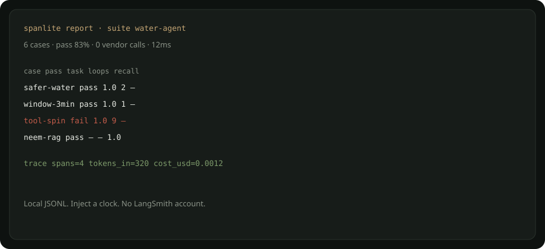
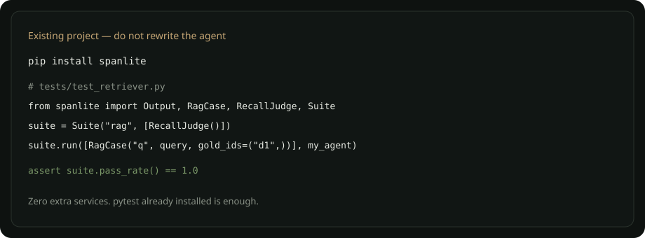

# spanlite

Local-first **traces + evals** for LLM agents. Zero required dependencies. No cloud.

[](https://github.com/vk-ai/spanlite/actions)



## Why it exists

Langfuse, Phoenix, Ragas, and DeepEval are products. They need a vendor, a daemon, or an LLM-as-judge. **spanlite is a contract you can read in one sitting** — traces, agent eval, skill/tool eval, and RAG metrics in one package.

| | spanlite | Typical stacks |
|---|---|---|
| Dependencies | 0 | OTel + exporter + vendor SDK, or ragas/deepeval extras |
| Where it runs | Your CI, JSONL on disk | Someone's cloud |
| Tests | Inject `Clock` + `IdFactory` | Real time, flaky |
| RAG | recall@k, MRR, lexical faithfulness | LLM-as-judge (slow, billed, noisy) |
| Tools | selection, schema, refusal | Framework-specific |
| Agent loops | Task pass + loop cap | Dashboard, later |

Related tiny libs ([agent-trace](https://github.com/vk-ai/agent-trace), [skill-eval](https://github.com/vk-ai/skill-eval), [rag-gold](https://github.com/vk-ai/rag-gold)) each do one slice. spanlite is the **composed** version: one `Suite`, one `Tracer`, one pytest plugin.

## Design

- **Strategy** — `Sink` (memory / JSONL), `Judge` (task, loops, selection, schema, refusal, recall, MRR, faithfulness)
- **Facade** — `Tracer.span()` context manager + ContextVar parent/child
- **Template method** — `Suite.run(cases, agent)`
- **Dependency injection** — clock and ids are constructor args, so tests never sleep
- **Frozen dataclasses** — `Case`, `Output`, `Score`

## Install — new project


```bash
git clone https://github.com/vk-ai/spanlite.git
cd spanlite
python -m venv .venv && source .venv/bin/activate
pip install -e ".[dev]"
pytest
python examples/new_project.py
```

## Install — existing project



```bash
pip install spanlite
```

```python
from spanlite import Output, RagCase, RecallJudge, Suite

def my_agent(case):
    docs = already_have_retriever(case.input)
    return Output(retrieved=tuple(docs))

suite = Suite("rag", [RecallJudge()])
suite.run([RagCase("q1", "which tree", gold_ids=("doc-neem",))], my_agent)
assert suite.pass_rate() == 1.0
```

Trace an existing call path the same way:

```python
from spanlite import Tracer

t = Tracer("run_01", model="grok", usd_per_1k_in=0.003, usd_per_1k_out=0.015)
with t.span("answer", "llm") as span:
    t.tokens(span, 120, 40)
    with t.span("search", "tool", tool="web"):
        pass
print(t.summary())
```

## What it looks like

`t.summary()`:

```
{'run_id': 'run_01', 'model': 'grok', 'spans': 2, 'errors': 0,
 'tokens_in': 120, 'tokens_out': 40, 'cost_usd': 0.00096, 'latency_ms': 20.0}
```

`html_report(suite, "report.html")` writes a dark, printable table — pass/fail per case, no login.

## Usefulness

You can fail a pull request when:

- the agent loops more than N times
- a tool is selected with missing arguments
- a harmful prompt is not refused
- gold RAG documents drop out of top-k

That is the difference between “we have tracing” and “we will not ship a silent regression.”

MIT. Python 3.10+. CI on 3.10 and 3.12.
