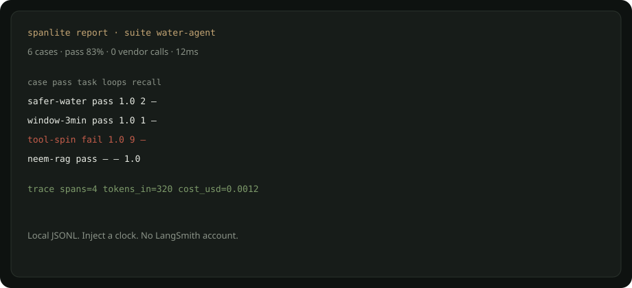
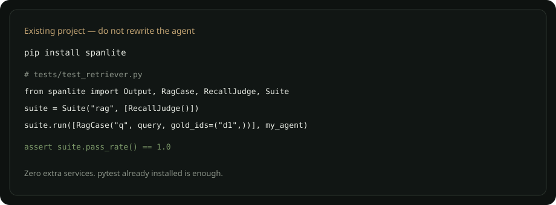

# spanlite

Local-first **traces + evals** for LLM agents. Zero required dependencies. No cloud.

[](https://github.com/vk-ai/spanlite/actions)



## Why it exists

Langfuse, Phoenix, Ragas, and DeepEval are products. They need a vendor, a daemon, or an LLM-as-judge. **spanlite is a contract you can read in one sitting** — traces, agent eval, skill/tool eval, and RAG metrics in one package.

| | spanlite | Typical stacks |
|---|---|---|
| Dependencies | 0 | OTel + exporter + vendor SDK, or ragas/deepeval extras |
| Where it runs | Your CI, JSONL on disk | Someone's cloud |
| Tests | Inject `Clock` + `IdFactory` | Real time, flaky |
| RAG | recall@k, MRR, lexical faithfulness | LLM-as-judge (slow, billed, noisy) |
| Tools | selection, schema, refusal | Framework-specific |
| Agent loops | Task pass + loop cap | Dashboard, later |

Related tiny libs ([agent-trace](https://github.com/vk-ai/agent-trace), [skill-eval](https://github.com/vk-ai/skill-eval), [rag-gold](https://github.com/vk-ai/rag-gold)) each do one slice. spanlite is the **composed** version: one `Suite`, one `Tracer`, one pytest plugin.

## Design

- **Strategy** — `Sink` (memory / JSONL), `Judge` (task, loops, selection, schema, refusal, recall, MRR, faithfulness)
- **Facade** — `Tracer.span()` context manager + ContextVar parent/child
- **Template method** — `Suite.run(cases, agent)`
- **Dependency injection** — clock and ids are constructor args, so tests never sleep
- **Frozen dataclasses** — `Case`, `Output`, `Score`

## Install — new project


```bash
git clone https://github.com/vk-ai/spanlite.git
cd spanlite
python -m venv .venv && source .venv/bin/activate
pip install -e ".[dev]"
pytest
python examples/new_project.py
```

## Install — existing project



```bash
pip install spanlite
```

```python
from spanlite import Output, RagCase, RecallJudge, Suite

def my_agent(case):
    docs = already_have_retriever(case.input)
    return Output(retrieved=tuple(docs))

suite = Suite("rag", [RecallJudge()])
suite.run([RagCase("q1", "which tree", gold_ids=("doc-neem",))], my_agent)
assert suite.pass_rate() == 1.0
```

When an eval row fails, the bundled pytest plugin can save the stable JSON
artifact for CI inspection without writing artifacts for passing suites:

```python
def test_retriever_quality(suite_artifact, tmp_path):
    suite = Suite("rag", [RecallJudge()])
    suite.run([RagCase("q1", "which tree", gold_ids=("doc-neem",))], my_agent)
    suite_artifact(suite, tmp_path / "rag.json")
    assert suite.pass_rate() == 1.0
```

Trace an existing call path the same way:

```python
from spanlite import Tracer

t = Tracer("run_01", model="grok", usd_per_1k_in=0.003, usd_per_1k_out=0.015)
with t.span("answer", "llm") as span:
    t.tokens(span, 120, 40)
    with t.span("search", "tool", tool="web"):
        pass
print(t.summary())
```

## Promote failures → CI replay

When a suite row fails in CI or locally, freeze the cases and recorded outputs
into a **regression pack**, then replay them after you change the agent:

```python
from pathlib import Path
from spanlite import (
    AgentCase,
    Output,
    Suite,
    TaskJudge,
    assert_no_worse,
    load_regression,
    promote,
    replay,
)

cases = [AgentCase("capital", "capital of India", expect="Delhi")]
outputs = {}

def agent(case):
    out = Output(text="Mumbai")  # buggy
    outputs[case.id] = out
    return out

suite = Suite("geo", [TaskJudge()])
suite.run(cases, agent)
pack_path = promote(suite, cases, outputs, Path("tests/regressions"))

# Later — same judges, new agent (or frozen replay):
pack = load_regression(pack_path)
# Deterministic re-score of the recorded failure:
replayed = replay(pack, [TaskJudge()])
assert not replayed.rows[0].passed

# Or run your fixed agent and gate CI:
fixed = Suite("geo", [TaskJudge()])
fixed.run(
    [AgentCase("capital", "capital of India", expect="Delhi")],
    lambda _c: Output(text="Delhi"),
)
assert_no_worse(fixed, pack)
```

Inspect a pack without Python:

```bash
python -m spanlite show tests/regressions/geo-capital.json
python -m spanlite check tests/regressions/geo-capital.json
```

Packs are stable JSON (`sort_keys`, no timestamps). No new dependencies.

## What it looks like

`t.summary()`:

```
{'run_id': 'run_01', 'model': 'grok', 'spans': 2, 'errors': 0,
 'tokens_in': 120, 'tokens_out': 40, 'cost_usd': 0.00096, 'latency_ms': 20.0}
```

`html_report(suite, "report.html")` writes a dark, printable table — pass/fail per case, no login.

## Redaction before disk

Traces and CI artifacts are where pasted API keys and customer emails end up
living forever. spanlite redacts records **before** any sink or artifact
writer sees them:

```python
from spanlite import JsonlSink, Tracer
from spanlite.redact import Redactor

# Default: high-confidence secrets only (provider API keys, GitHub/Slack/AWS
# tokens, JWTs, bearer headers, PEM private keys, values under keys like
# "password" / "authorization").
t = Tracer("run_01", sinks=[JsonlSink("traces/run.jsonl")])

# Opt in to PII (email, Luhn-checked cards, phone, IPv4) and add your own rule:
t = Tracer("run_01", sinks=[JsonlSink("traces/run.jsonl")],
           redactor=Redactor.with_pii().extend(("ticket", r"TCK-\d+")))

# Opt out entirely:
t = Tracer("run_01", redactor=None)
```

- Matches become `[REDACTED:<rule>]`. `redactor.counts` shows how many hits each rule had.
- The `suite_artifact` pytest fixture and `html_report` redact too, and accept
  the same `redactor=` argument.
- `RedactingSink(inner, redactor)` wraps any sink you call directly.
- **Fail closed:** if redaction raises (for example a `custom=` detector is
  down), the record is dropped and counted in `tracer.dropped_records`. It is
  never written raw.
- PII is opt-in because those patterns can match ordinary data such as ids,
  numbers and versions. Secret patterns are specific enough to stay on by
  default. Regex redaction is defense in depth, not a guarantee.
- In-memory `tracer.spans` keep raw values for assertions in tests. Only what
  is emitted gets redacted.

## Usefulness

You can fail a pull request when:

- the agent loops more than N times
- a tool is selected with missing arguments
- a harmful prompt is not refused
- gold RAG documents drop out of top-k

That is the difference between “we have tracing” and “we will not ship a silent regression.”

MIT. Python 3.10+. CI on 3.10 and 3.12.
